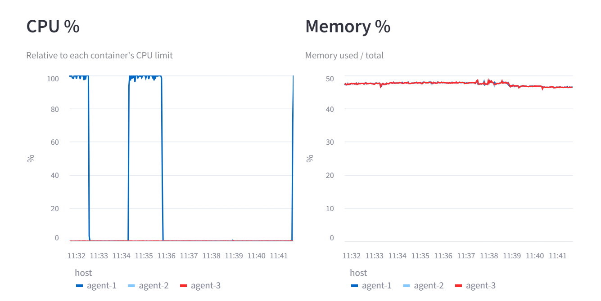
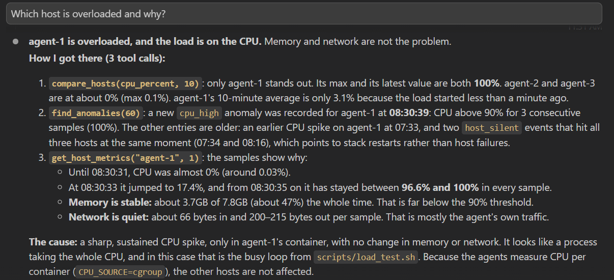
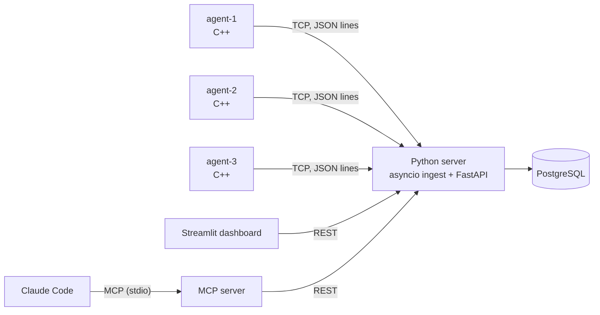

# SysPulse

[](https://github.com/shuvat/syspulse/actions/workflows/ci.yml)

Multithreaded C++ agents stream Linux metrics over TCP to a Python/PostgreSQL backend that
detects anomalies, with a live dashboard and an MCP server that lets Claude answer
*"Which host is overloaded and why?"*

<!-- DEMO: add docs/media/dashboard.png (or .gif) and docs/media/claude.png, then uncomment:


-->

## What it does

- **Agents (C++17):** each samples CPU, memory and network every 2 seconds from `/proc` and
  its container's cgroup, and streams newline-delimited JSON over TCP. A collector thread and
  a sender thread share a bounded queue; the sender reconnects with exponential backoff.
- **Server (Python):** an asyncio TCP ingest and a FastAPI REST API in one process. Samples go
  to PostgreSQL; anomaly rules (CPU, memory, silent host) run on every sample.
- **Dashboard (Streamlit):** hosts, live CPU and memory charts, and anomalies.
- **MCP server:** four tools (`list_hosts`, `get_host_metrics`, `find_anomalies`,
  `compare_hosts`) so an LLM client such as Claude Code can investigate the system itself.

## Architecture



Everything runs with Docker Compose. Details: [docs/architecture.md](docs/architecture.md).

## Quick start

Requires Docker with Compose v2.

```bash
git clone https://github.com/shuvat/syspulse.git && cd syspulse
docker compose up -d --build --wait
# Dashboard: http://localhost:8501   REST API docs: http://localhost:8000/docs
```

Put load on one host and watch the CPU anomaly appear (for agent-1 only):

```bash
./scripts/load_test.sh
```

Ask Claude about it: the repo includes `.mcp.json`, so Claude Code offers the `syspulse` MCP
server when started in the repo (approve it, then ask *"Which host is overloaded and why?"*).
The MCP server needs its Python environment once:

```bash
python3 -m venv mcp_server/.venv && mcp_server/.venv/bin/pip install -r mcp_server/requirements.txt
```

Stop with `docker compose down` (add `-v` to delete the database).

## Engineering highlights

- **Per-container CPU from cgroups.** Inside a container, `/proc/stat` shows the whole machine,
  so all agents reported the same CPU. The agent reads its own cgroup (`cpu.stat`) instead,
  and reports CPU relative to the container's limit (`cpu.max`). That second step fixed a
  flaky test: measured against the whole machine, the result depended on whatever else was
  running. ([decisions](docs/decisions.md#cpu-percent-relative-to-the-containers-cpu-limit))
- **A deadlock diagnosed with GDB.** A planted self-deadlock in the thread-safe queue: no crash,
  no error, the agent even ignored SIGTERM. `thread apply all bt` and the mutex's owner thread
  id showed a thread waiting for itself. ([debugging](docs/debugging.md#gdb))
- **Memory and thread safety checked by tools.** ThreadSanitizer for data races; valgrind on
  the real agent (including reconnect and shutdown) and on all tests: 0 leaks, 0 errors.
  Valgrind runs in CI. ([debugging](docs/debugging.md#valgrind-memory-leaks-and-invalid-memory-access))
- **An LLM's explanation is a hypothesis.** In the MCP demo Claude found the overloaded host
  correctly, but explained an old anomaly with a wrong guess. Checking it against the data
  found two real issues in the anomaly rules. ([MCP demo](docs/mcp_demo.md))
- **End-to-end integration test.** One script starts the whole stack and checks the full path,
  from agent to MCP tool, in an isolated Compose project; it runs in CI after all unit tests.

## Tech stack

| Layer | Technologies |
|---|---|
| Agent | C++17, CMake, POSIX sockets, `std::thread` / `mutex` / `condition_variable`, nlohmann/json, GoogleTest |
| Server | Python 3.12, asyncio, FastAPI, SQLModel / SQLAlchemy, PostgreSQL 17, Pydantic |
| AI integration | MCP Python SDK (`MCPServer`), Claude Code |
| Dashboard | Streamlit, pandas |
| Infrastructure | Docker (multi-stage builds), Docker Compose, cgroup v2 |
| Quality | GitHub Actions, pytest, ruff, valgrind, ThreadSanitizer, GDB |

## Testing and CI

| Level | What | Count |
|---|---|---|
| Unit (C++) | Parsers, CPU math, queue under concurrency, TCP sender against a real socket | 52 |
| Unit + DB (server) | Anomaly rules, ingest, every REST endpoint, against a real PostgreSQL | 52 |
| MCP tools | All tools through the MCP SDK, REST API mocked at the HTTP layer | 17 |
| Dashboard | Data functions, and the whole app with Streamlit's `AppTest` | 12 |
| Integration | Whole Compose stack: data flow, CPU anomaly, MCP ranking | 1 script |

CI runs six jobs on every push: C++ build and tests (also under valgrind), server tests with
a PostgreSQL service container, MCP tests, dashboard tests, ruff, and then the integration
test.

## Repository layout

```
agent/        C++ agent (src/, tests/, multi-stage Dockerfile)
server/       Python ingest + REST API + anomaly rules (app/, tests/)
mcp_server/   MCP server for LLM clients (server.py, tests/)
dashboard/    Streamlit dashboard (app.py, data.py, tests/)
scripts/      load_test.sh, integration_test.sh
docs/         architecture, design decisions, debugging notes, MCP demo
```

## Documentation

- [Architecture](docs/architecture.md): components, data flow, schema, deployment, CI
- [Design decisions](docs/decisions.md): what was chosen, why, and the alternatives
- [Debugging notes](docs/debugging.md): real problems found while building, and how
- [MCP demo](docs/mcp_demo.md): Claude investigating a load spike, and what it revealed

Known limitations (memory is still measured for the whole machine, anomaly rules without
hysteresis, no database migrations) are listed in [decisions](docs/decisions.md).
