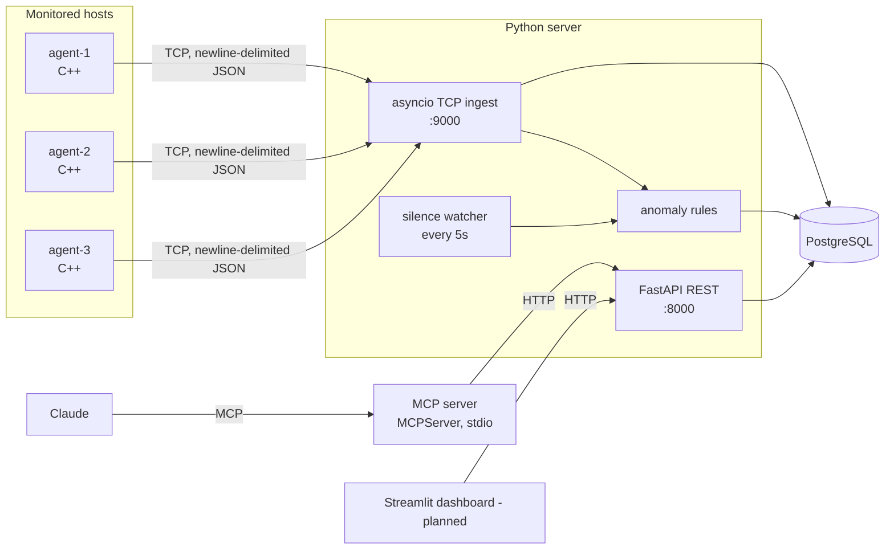
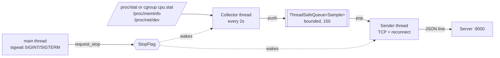
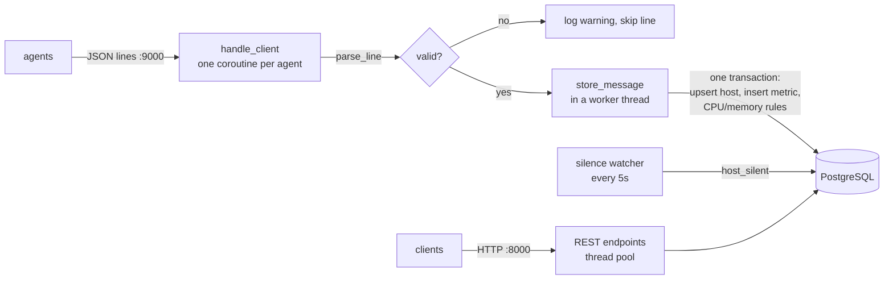
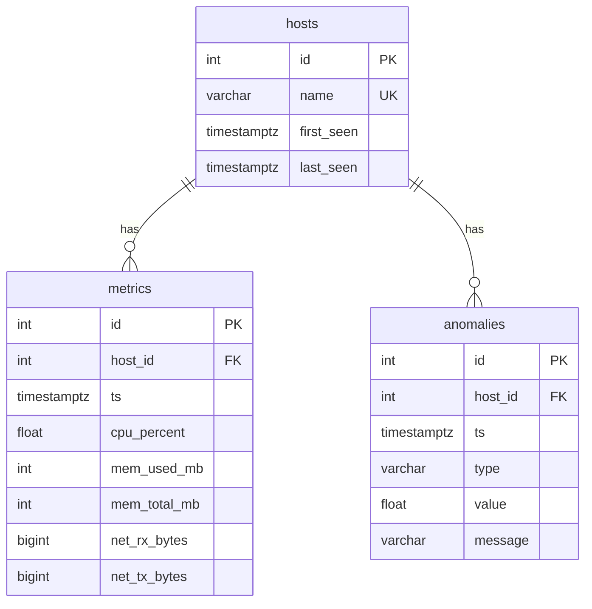
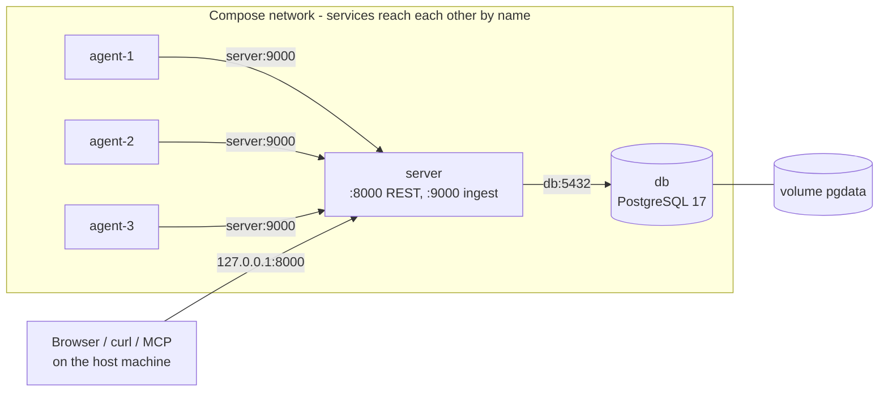
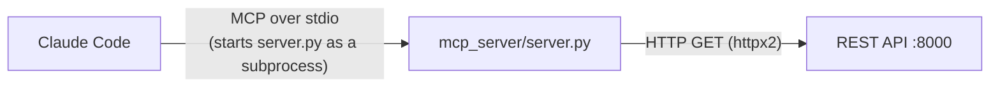

# Architecture

SysPulse collects system metrics from Linux hosts, stores them in PostgreSQL,
detects anomalies, and exposes the data to a dashboard and to an LLM through MCP.

> Status: the C++ agent, the Python server and the Docker Compose deployment (with a load
> test) and the MCP server are implemented. The dashboard is planned (marked *planned* below).

## Overview



## Data flow

1. Each agent samples `/proc` (and, in a container, its cgroup's CPU usage) every 2 seconds
   and sends one JSON object per line over TCP.
2. The ingest server validates each line, upserts the host, stores the metric and runs the
   CPU and memory anomaly rules, all in one transaction.
3. A background task checks every 5 seconds for hosts that went silent.
4. The REST API serves hosts, metrics and anomalies.
5. The MCP server is a read-only client of the REST API; the dashboard will be one too. *(dashboard planned)*

## Message format

One JSON object per line (`\n`-terminated):

```json
{"host":"agent-1","ts":1760000000,"cpu_percent":37.5,"mem_used_mb":2048,"mem_total_mb":8192,"net_rx_bytes":123456,"net_tx_bytes":65432}
```

| Field | Meaning |
|---|---|
| `host` | Agent name (`AGENT_NAME`) |
| `ts` | Unix time in seconds when the sample was taken |
| `cpu_percent` | CPU busy share since the previous sample, 0-100 (100 = every CPU busy). Whole machine (`/proc/stat`) or only the agent's container (cgroup), see `CPU_SOURCE` |
| `mem_used_mb` / `mem_total_mb` | `MemTotal - MemAvailable` / `MemTotal` from `/proc/meminfo` |
| `net_rx_bytes` / `net_tx_bytes` | Cumulative byte counters, summed over all interfaces except `lo` |

Network counters are cumulative; rates are computed by the readers from consecutive samples.

## Agent (C++17)



### Files

| File | Responsibility |
|---|---|
| `src/collector.{h,cpp}` | Pure parsers for `/proc` and cgroup `cpu.stat` (take `std::string`, return `std::optional`), `cpu_percent`, `cgroup_cpu_percent`, `read_file`, collector thread |
| `src/sender.{h,cpp}` | `to_json`, RAII `Socket`, `connect_to`, `send_all`, `next_backoff`, sender thread |
| `src/queue.h` | `ThreadSafeQueue<T>`: bounded, `std::mutex` + `std::condition_variable`, `close()` for shutdown |
| `src/stop_flag.h` | `StopFlag`: a stop request that sleeping threads can wait on |
| `src/main.cpp` | Configuration from env vars, signal handling, thread startup and shutdown order |

### Threads

- **Collector**: reads a CPU baseline, then every 2 seconds reads `/proc`, builds a `Sample`
  and pushes it to the queue. It waits with `StopFlag::wait_for`, so shutdown is immediate.
- **Sender**: pops samples and sends them as JSON lines. On failure it closes the socket,
  reconnects with exponential backoff (1s doubling up to 30s) and resends the same sample.
- **Main**: blocks `SIGINT`/`SIGTERM` before starting the threads (they inherit the mask),
  then waits for a signal with `sigwait`.

### Shutdown sequence

1. `main` receives `SIGINT`/`SIGTERM` and calls `stop.request_stop()`.
2. The collector wakes from its wait and returns; `main` joins it.
3. `main` calls `queue.close()`. The sender sends whatever is left in the queue
   (if connected) and returns when `pop()` returns `std::nullopt`.
4. `main` joins the sender and exits with code 0.

The producer is stopped before the queue is closed, so no collected sample is rejected.

### Configuration

| Variable | Default | Meaning |
|---|---|---|
| `AGENT_NAME` | `agent` | Value of the `host` field |
| `SERVER_HOST` | `127.0.0.1` | Server name or IP (resolved with `getaddrinfo`) |
| `SERVER_PORT` | `9000` | Server TCP port (1-65535; invalid values exit with an error) |
| `CPU_SOURCE` | `proc` | `proc`: CPU of the whole machine. `cgroup`: CPU of this container only (invalid values exit with an error) |

### CPU inside a container

Containers share the host kernel. Namespaces limit what a process *sees*, but `/proc/stat`
and `/proc/meminfo` are not namespaced: inside a container they describe the whole machine
(`/proc/net/dev` is per network namespace, so network counters are already per container).
CPU time used by one container is accounted in its cgroup, in `/sys/fs/cgroup/cpu.stat`
(`usage_usec`). With `CPU_SOURCE=cgroup` (set in `docker-compose.yml`) the agent computes:

```
cpu_percent = delta usage_usec / (elapsed steady_clock time x number of CPUs) x 100
```

This is the same scale as `/proc/stat`, so the anomaly rule keeps its meaning. Memory still
comes from `/proc/meminfo`. See `decisions.md` for the trade-offs.

### Build and tests

```bash
cd agent
cmake -S . -B build && cmake --build build
ctest --test-dir build --output-on-failure
```

Dependencies are fetched with CMake `FetchContent` and pinned to releases:
nlohmann/json v3.12.0 and GoogleTest v1.17.0 (tests only; `-DBUILD_TESTING=OFF` skips them).

The test suite covers the parsers (including malformed input), `cpu_percent` and
`cgroup_cpu_percent` edge cases, the collector thread with both CPU sources,
the queue and stop flag under concurrency, JSON serialization, and the sender against a
real local TCP server (send, reconnect, prompt shutdown while the server is down).

## Server (Python)

One process runs everything: the FastAPI `lifespan` starts the TCP ingest server and the
silence watcher next to the REST API, all on one asyncio event loop.



### Files

| File | Responsibility |
|---|---|
| `app/main.py` | FastAPI app, `lifespan` (startup/shutdown), REST endpoints, response models, silence watcher |
| `app/ingest.py` | `MetricMessage` validation, `parse_line`, `store_message`, TCP server start/stop |
| `app/anomalies.py` | Pure anomaly rules: `check_cpu`, `check_memory`, `check_silence` |
| `app/models.py` | SQLModel tables: `Host`, `Metric`, `Anomaly` |
| `app/db.py` | Engine from `DATABASE_URL`, `create_db_and_tables`, `get_session` |

### Database schema



`metrics` has a composite index on `(host_id, ts)` for the "samples of one host in a time
window" query. Tables are created with `create_all` at startup (no migrations yet).

### Ingest

- One coroutine per connection reads lines with `readline()` (max 64 KB per line).
- Bad lines are logged and skipped; a too-long line or a reset closes only that connection;
  a database error drops only that sample. The server itself never stops on bad input.
- Database writes run in a worker thread (`asyncio.to_thread`), so the event loop keeps
  serving other agents and the REST API. Samples from one agent stay in order.
- On shutdown, the server stops accepting connections and closes the open ones.

### Anomaly rules

| Type | Rule | Where it runs |
|---|---|---|
| `cpu_high` | CPU > 90% for 3 consecutive samples | after each sample, in `store_message` |
| `memory_high` | `mem_used_mb / mem_total_mb` > 90% | after each sample, in `store_message` |
| `host_silent` | no data for more than 30 seconds | background task, every 5 seconds |

Rules are edge-triggered: one anomaly when a condition starts, not one per sample while it lasts.
Known limits (flapping without hysteresis, false `host_silent` after the machine sleeps) are
described in [decisions.md](decisions.md) and [mcp_demo.md](mcp_demo.md).

### REST API

| Endpoint | Returns |
|---|---|
| `GET /health` | `200` if the database answers, `503` if not |
| `GET /hosts` | All hosts with `first_seen` / `last_seen`, sorted by name |
| `GET /hosts/{name}/metrics?minutes=10` | Samples of one host, oldest first; `404` for an unknown host |
| `GET /anomalies?minutes=60` | Anomalies across all hosts with the host name, newest first |

`minutes` must be 1-1440 (otherwise `422`). Interactive docs: `http://localhost:8000/docs`.

### Run and tests

```bash
docker compose up -d --wait db
cd server
python3 -m venv .venv && source .venv/bin/activate
pip install -r requirements-dev.txt
uvicorn app.main:app --port 8000
pytest -v
```

Tests run against a separate database, `syspulse_test`, which the test setup creates and
empties before each test. They cover the anomaly rules (pure), line parsing, storing samples
and anomalies, the silence watcher with a controlled clock, and every REST endpoint.

## Deployment (Docker Compose)

`docker-compose.yml` runs the whole system: PostgreSQL, the server and three agents.



- **Ports**: only `127.0.0.1:8000` (REST API) and `127.0.0.1:5432` (database, for local
  development) are published, and only on localhost. Port 9000 is not published: only the
  agents use it, over the internal network.
- **Startup order**: `depends_on` with `condition: service_healthy` waits until a service is
  *ready*, not only started: `db` (`pg_isready`) -> `server` (`GET /health`, which also
  checks the database) -> agents. `restart: unless-stopped` on the server and the agents.
- **Data**: the `pgdata` volume keeps the database across `docker compose down`;
  `docker compose down -v` deletes it (needed after a model change, as there are no migrations).
- **Agents**: one shared definition (YAML anchor `x-agent`), each with its own `AGENT_NAME`
  and `CPU_SOURCE=cgroup`.

### Images

| Image | Build | Notes |
|---|---|---|
| agent | Multi-stage: `ubuntu:24.04` + build tools -> `ubuntu:24.04` with only the binary | 118MB; compilers stay in the build stage |
| server | Single stage: `python:3.12-slim` | Nothing is compiled (`psycopg[binary]` ships libpq); dependencies are installed before the code is copied, so that layer stays cached |

Both run as a non-root user and start the process in exec form, so it is PID 1 and receives
the `SIGTERM` from `docker stop` directly.

### Load test

`scripts/load_test.sh` starts one busy loop per CPU inside agent-1 for 30 seconds and polls
`GET /anomalies` until a `cpu_high` anomaly appears. It passes only if the anomaly is
reported for agent-1 **and not** for agent-2 or agent-3, which shows that each agent measures
its own container. Only anomalies newer than the start of the run count, so results of
earlier runs cannot make it pass. With the 2-second interval and the 3-sample rule, the
anomaly appears after about 10 seconds.

### Run the full system

```bash
docker compose up -d --build --wait
curl -s localhost:8000/hosts
./scripts/load_test.sh
docker compose down          # add -v to also delete the database
```

## MCP server (Python)

`mcp_server/server.py` lets an LLM client (Claude Code) query SysPulse. It uses the official
MCP Python SDK, `mcp` 2.3.0, where FastMCP is called `MCPServer`. It has its own venv and
`requirements.txt`, separate from the server. A recorded demo with the tool calls and the
answer is in [mcp_demo.md](mcp_demo.md).



| Tool | Calls | Returns |
|---|---|---|
| `list_hosts()` | `GET /hosts` | Hosts with `first_seen` / `last_seen` |
| `get_host_metrics(host, minutes=10)` | `GET /hosts/{host}/metrics` | Raw samples, oldest first |
| `find_anomalies(minutes=60)` | `GET /anomalies` | Anomalies across hosts, newest first |
| `compare_hosts(metric="cpu_percent", minutes=10)` | `GET /hosts` + metrics per host | Hosts ranked by average (`cpu_percent` or `mem_percent`), with max and latest |

- Every tool is read-only; the REST API owns the data and the anomaly rules.
- The type hints are the tool schema the model sees: `minutes` is limited to 1-1440 and
  `metric` is an enum, so invalid arguments are rejected before the tool runs.
- Docstrings are the tool descriptions the model reads to choose a tool; they explain what
  the values mean (for example what `cpu_high` is).
- Expected failures (unknown host, API down) raise `ToolError`: the model gets a clear
  message, for example "host 'x' not found. Call list_hosts to see valid host names."
- The ranking is a pure function, `rank_hosts`; hosts without samples are listed last with
  `samples=0` instead of being dropped.
- Logs go to stderr: with the stdio transport, stdout carries the protocol.
- Registered for Claude Code in `.mcp.json` (project scope, relative paths, committed).
  Claude Code asks the user to approve a project server before it runs it.

### Run

```bash
cd mcp_server
python3 -m venv .venv && .venv/bin/pip install -r requirements.txt
# Claude Code starts it automatically from .mcp.json; API_URL defaults to http://localhost:8000
.venv/bin/pip install -r requirements-dev.txt && .venv/bin/pytest
```

Tests replace the REST API at the HTTP layer (`httpx2.MockTransport`), so no server is needed.
They call the tools through `mcp.call_tool`, like a real client: results, query parameters
sent to the API, error messages (unknown host, API down, HTTP 500), arguments rejected by the
schema before any API call, and the pure ranking (`rank_hosts`, `metric_value`).
