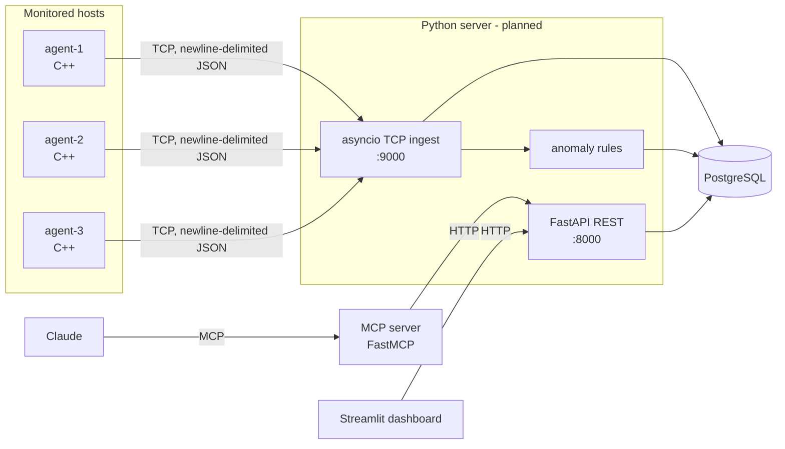
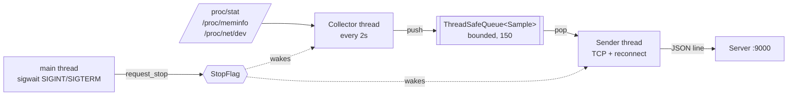

# Architecture

SysPulse collects system metrics from Linux hosts, stores them in PostgreSQL,
detects anomalies, and exposes the data to a dashboard and to an LLM through MCP.

> Status: the C++ agent is implemented. The server, MCP server and dashboard
> are planned (marked *planned* below).

## Overview



## Data flow

1. Each agent samples `/proc` every 2 seconds and sends one JSON object per line over TCP.
2. The ingest server parses each line, upserts the host, stores the metric and runs the
   anomaly rules. *(planned)*
3. The REST API serves hosts, metrics and anomalies. *(planned)*
4. The dashboard and the MCP server are read-only clients of the REST API. *(planned)*

## Message format

One JSON object per line (`\n`-terminated):

```json
{"host":"agent-1","ts":1760000000,"cpu_percent":37.5,"mem_used_mb":2048,"mem_total_mb":8192,"net_rx_bytes":123456,"net_tx_bytes":65432}
```

| Field | Meaning |
|---|---|
| `host` | Agent name (`AGENT_NAME`) |
| `ts` | Unix time in seconds when the sample was taken |
| `cpu_percent` | CPU busy share since the previous sample, 0-100 |
| `mem_used_mb` / `mem_total_mb` | `MemTotal - MemAvailable` / `MemTotal` from `/proc/meminfo` |
| `net_rx_bytes` / `net_tx_bytes` | Cumulative byte counters, summed over all interfaces except `lo` |

Network counters are cumulative; rates are computed on the server from consecutive samples.

## Agent (C++17)



### Files

| File | Responsibility |
|---|---|
| `src/collector.{h,cpp}` | Pure parsers for `/proc` (take `std::string`, return `std::optional`), `cpu_percent`, `read_file`, collector thread |
| `src/sender.{h,cpp}` | `to_json`, RAII `Socket`, `connect_to`, `send_all`, `next_backoff`, sender thread |
| `src/queue.h` | `ThreadSafeQueue<T>`: bounded, `std::mutex` + `std::condition_variable`, `close()` for shutdown |
| `src/stop_flag.h` | `StopFlag`: a stop request that sleeping threads can wait on |
| `src/main.cpp` | Configuration from env vars, signal handling, thread startup and shutdown order |

### Threads

- **Collector**: reads a CPU baseline, then every 2 seconds reads `/proc`, builds a `Sample`
  and pushes it to the queue. It waits with `StopFlag::wait_for`, so shutdown is immediate.
- **Sender**: pops samples and sends them as JSON lines. On failure it closes the socket,
  reconnects with exponential backoff (1s doubling up to 30s) and resends the same sample.
- **Main**: blocks `SIGINT`/`SIGTERM` before starting the threads (they inherit the mask),
  then waits for a signal with `sigwait`.

### Shutdown sequence

1. `main` receives `SIGINT`/`SIGTERM` and calls `stop.request_stop()`.
2. The collector wakes from its wait and returns; `main` joins it.
3. `main` calls `queue.close()`. The sender sends whatever is left in the queue
   (if connected) and returns when `pop()` returns `std::nullopt`.
4. `main` joins the sender and exits with code 0.

The producer is stopped before the queue is closed, so no collected sample is rejected.

### Configuration

| Variable | Default | Meaning |
|---|---|---|
| `AGENT_NAME` | `agent` | Value of the `host` field |
| `SERVER_HOST` | `127.0.0.1` | Server name or IP (resolved with `getaddrinfo`) |
| `SERVER_PORT` | `9000` | Server TCP port (1-65535; invalid values exit with an error) |

### Build and tests

```bash
cd agent
cmake -S . -B build && cmake --build build
ctest --test-dir build --output-on-failure
```

Dependencies are fetched with CMake `FetchContent` and pinned to releases:
nlohmann/json v3.12.0 and GoogleTest v1.17.0 (tests only; `-DBUILD_TESTING=OFF` skips them).

The test suite covers the parsers (including malformed input), `cpu_percent` edge cases,
the queue and stop flag under concurrency, JSON serialization, and the sender against a
real local TCP server (send, reconnect, prompt shutdown while the server is down).
